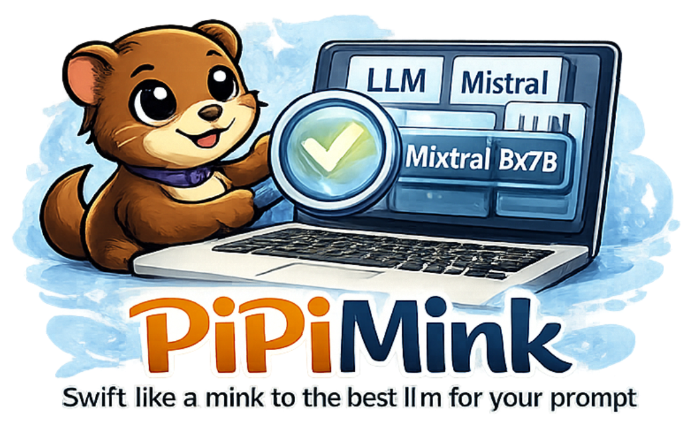
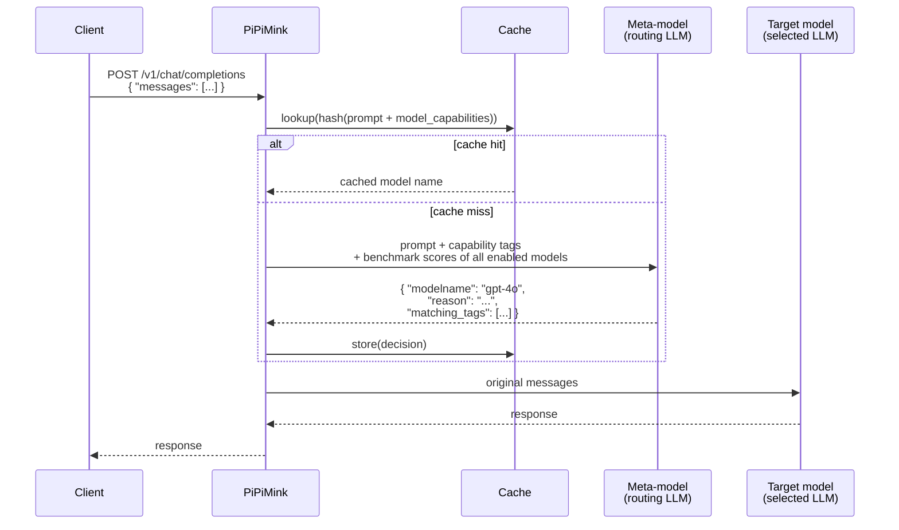

<p align="center">
  
</p>

<p align="center">
  <strong>Route every prompt to the best model — for you specifically.</strong>
</p>

<p align="center">
  <a href="https://github.com/Izzetee/PiPiMink/actions/workflows/ci.yml"></a>
  <a href="https://github.com/Izzetee/PiPiMink/actions/workflows/security.yml"></a>
  <a href="LICENSE"></a>
</p>

PiPiMink is a Go service that routes each prompt to the LLM most likely to produce the best response — **for you specifically**.

## The Core Idea

Most AI routers use generic, one-size-fits-all benchmarks (MMLU, HumanEval, etc.) that measure average performance across millions of anonymous prompts. PiPiMink takes the opposite approach: **it learns which models work best for your actual use cases**, based on benchmarks you define and results you observe yourself.

The routing is intentionally subjective. A model that scores 90% on a generic coding benchmark may still give worse answers than a smaller local model for *your* specific coding style, domain, or workflow. PiPiMink lets you measure exactly that.

**There is no global leaderboard that defines what "best" means. You do.**

## How It Works

### Request flow

Every chat request goes through two steps: a routing decision, then the actual model call.



The routing priority inside the meta-model call is:

1. **Capability tags** — primary signal (what the model says it excels at)
2. **Benchmark scores** — secondary signal (how the model actually performed on *your* tasks)
3. **Average response time** — tiebreaker only (measured latency from benchmarks)

### 1. Self-reported capability tags

During a model refresh, PiPiMink asks every available model to assess its own strengths and weaknesses. Each model replies with a structured JSON tag list:

```json
{
  "strengths": ["code-generation", "step-by-step-reasoning", "multilingual"],
  "weaknesses": ["real-time-information", "image-generation"]
}
```

These tags are stored in PostgreSQL alongside each model's metadata. The exact prompts used for this interview are editable in the admin config page — you can steer which capability dimensions get reported.

### 2. Prompt-driven routing

When a chat request arrives, PiPiMink sends the user's prompt — along with the capability tags and benchmark scores of all enabled models — to a configurable meta-model. The meta-model returns a structured routing decision:

```json
{
  "modelname": "gpt-4o",
  "reason": "The request requires deep reasoning and code review",
  "matching_tags": ["code-generation", "step-by-step-reasoning"],
  "tag_relevance": { "code-generation": 9, "step-by-step-reasoning": 8 }
}
```

PiPiMink then forwards the original prompt to the selected model and returns its response.

### 3. Your benchmarks, your signal

The built-in benchmark suite evaluates models across coding, reasoning, instruction-following, creative writing, summarization, and factual QA. Scores are measured by an LLM judge you configure — meaning the evaluation reflects your standards, not an industry average.

Because benchmark results feed directly into the routing decision, the more you benchmark with tasks relevant to your workflow, the better the routing gets — for you.

### 4. Response time measurement

Response time is measured automatically during benchmark runs. Each benchmark task records how long the model took to respond (in milliseconds). These per-task latencies are averaged per model and stored in PostgreSQL.

When the meta-model makes a routing decision, the average response time is included as a **tiebreaker only**: if two models are equally suited based on capability tags and benchmark scores, the faster one is preferred. Latency never overrides a better quality match.

Models that have not been benchmarked yet simply have no latency data — routing works normally based on tags alone.

### 5. Routing decision cache

Routing decisions are cached in memory using a hash of the normalized prompt and the current capability snapshot. Cache entries expire by TTL and are evicted by LRU when the size limit is reached, so the router stays fast for repeated or similar prompts.

## Supported Providers

| Type | Examples |
| --- | --- |
| `openai-compatible` | OpenAI, Gemini, OpenRouter, LM Studio, any local server (Ollama, llama.cpp, MLX) |
| `anthropic` | Anthropic Claude (uses the native Messages API) |

Azure AI Foundry is supported via per-model `model_configs` entries. See [SETUP.md](SETUP.md#microsoft-azure-ai-foundry) for details.

## Exposed APIs

PiPiMink is a drop-in proxy. Existing clients require no changes:

| Endpoint | Description |
| --- | --- |
| `POST /chat` | Native PiPiMink — always auto-routes |
| `GET /models` | List all models with tags, scores, and latency |
| `POST /v1/chat/completions` | OpenAI-compatible (streaming supported) |
| `GET /v1/models` | OpenAI-compatible model list |
| `POST /api/chat`, `GET /api/tags` | Ollama-compatible |
| `GET/POST /providers` | Provider CRUD |
| `POST /models/{name}/reset`, `DELETE /models/{name}` | Model reset / full delete |
| `GET /console/` | Console UI — models, providers, benchmarks, analytics, users |
| `GET /metrics` | Prometheus/OpenMetrics |

Clients like **Open WebUI** can connect directly using either the OpenAI-compatible or Ollama-compatible endpoint. PiPiMink will appear as a single model and route each request internally.

## Authentication

PiPiMink supports two authentication modes:

- **API-key-only** — when no OAuth provider is configured, all requests pass through unauthenticated. The `X-API-Key` header gates admin endpoints. This is the default out-of-the-box experience.
- **OAuth2/OIDC + Bearer tokens** — when Authentik (or another OIDC provider) is configured, the console requires a user session. Programmatic API access uses Bearer tokens created via `POST /auth/tokens`.

By default, chat and inference endpoints (`/chat`, `/v1/chat/completions`, `/api/chat`) do **not** require authentication (`REQUIRE_AUTH_FOR_CHAT=false`), preserving backward compatibility with existing clients. Set `REQUIRE_AUTH_FOR_CHAT=true` in production to require a valid session or Bearer token for all chat requests.

**Bearer token example:**

```bash
curl -H "Authorization: Bearer ppm_your-token" \
  http://localhost:8080/v1/chat/completions \
  -d '{"messages":[{"role":"user","content":"Hello"}]}'
```

See [SETUP.md](SETUP.md#authentication) for full configuration details.

## Benchmarks

| Category | Scoring |
| --- | --- |
| `coding` | LLM judge — multi-criteria (correctness, efficiency, clarity, edge cases) |
| `reasoning` | Deterministic — exact numeric answer |
| `instruction-following` | Format validator — structural checks |
| `creative-writing` | LLM judge — multi-criteria (imagery, originality, structure, tone) |
| `summarization` | LLM judge — multi-criteria (coverage, accuracy, conciseness, format) |
| `coding-security` | LLM judge — multi-criteria (vulnerability identification, fix quality, security reasoning) |
| `factual-qa` | Deterministic — substring match |

LLM-judge tasks use a configurable judge model (`BENCHMARK_JUDGE_PROVIDER` / `BENCHMARK_JUDGE_MODEL`). Each criterion is scored independently on a 0–10 scale; the final score is the average across all criteria. This gives fine-grained, continuous scores rather than binary pass/fail.

Benchmark scores feed directly into routing decisions as the secondary signal after capability tags, pushing traffic toward models that empirically perform better on the types of tasks you actually run.

## Architecture

| Path | Purpose |
| --- | --- |
| `main.go` | Entry point |
| `cmd/server/` | HTTP server, handlers, routing logic, auth middleware |
| `internal/llm/` | Provider clients, capability tagging, model selection, routing cache |
| `internal/config/` | Configuration loading, settings registry, `.env` management |
| `internal/benchmark/` | Benchmark task definitions, runner, scorer |
| `internal/database/` | PostgreSQL persistence and schema migration |
| `internal/models/` | Domain types |
| `docs/` | Generated OpenAPI / Swagger artifacts |

## Quick Start

```bash
./scripts/start-stack.sh                    # start DB + app
```

Open `http://localhost:8080` — the setup wizard will guide you through configuring an admin key, adding providers, and discovering models.

For file-based configuration or advanced setups (Azure AI Foundry, Authentik OAuth, local development), see **[SETUP.md](SETUP.md)**.

## AI-Assisted Development

This project was developed with the assistance of AI coding tools. Contributions that use AI are welcome — see [CONTRIBUTING.md](CONTRIBUTING.md#ai-assisted-development) for guidelines.

## License

PiPiMink is open source software licensed under the [Apache License 2.0](LICENSE). You are free to use, modify, and redistribute the code under the terms of that license.

The project name "PiPiMink", logo, and official branding are governed by a separate [trademark policy](TRADEMARKS.md) and are not covered by the Apache-2.0 license.

See also: [NOTICE](NOTICE) | [CONTRIBUTING.md](CONTRIBUTING.md) | [TRADEMARKS.md](TRADEMARKS.md)
